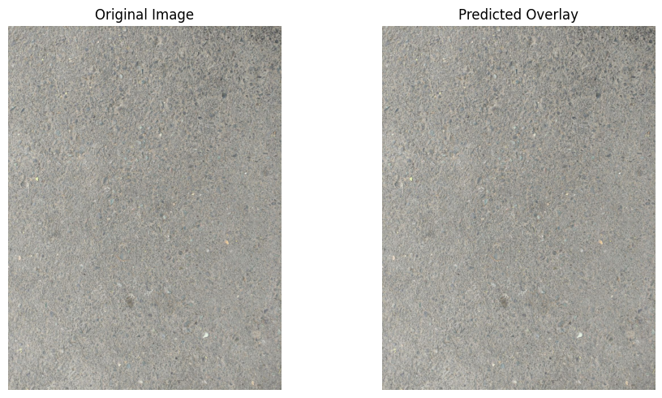
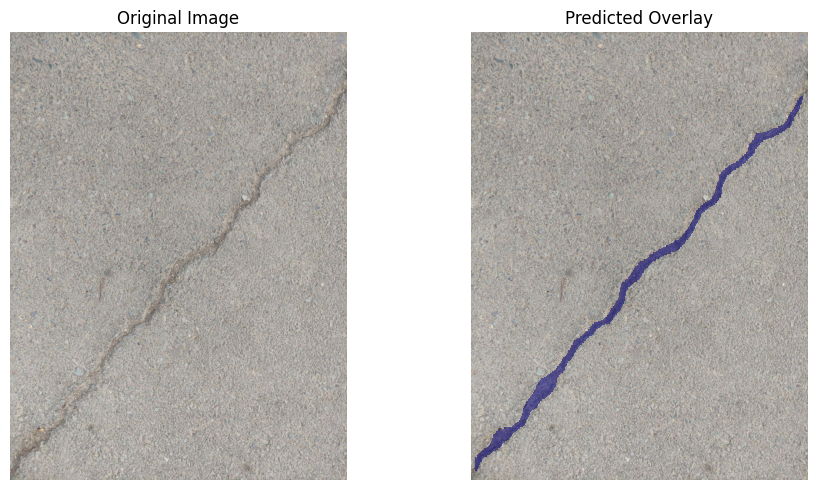
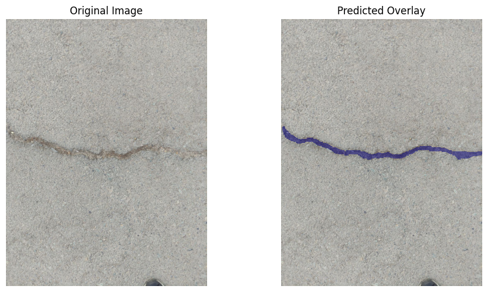
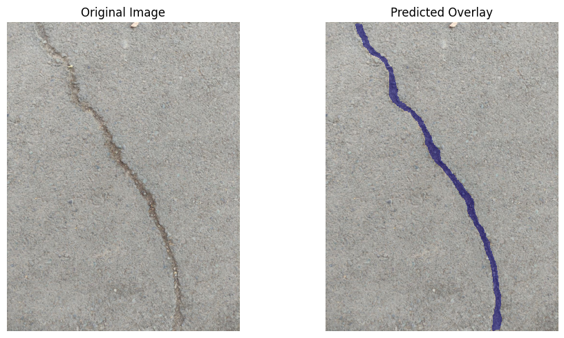
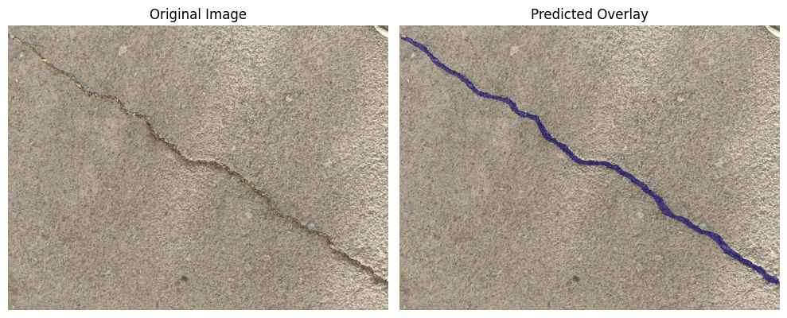

# Crack Segmentation using PyTorch and U-Net 

## Overview

This repository provides a complete deep learning pipeline for **semantic segmentation** of cracks in concrete or asphalt surfaces. The core of the project is a custom **U-Net** architecture implemented in PyTorch, designed to classify every pixel in an image as either crack or non-crack.

The project is structured into three main phases:
1.  **Data Preparation** (cleanup, merging, splitting using COCO format).
2.  **Model Training** (U-Net with transfer learning options).
3.  **Inference** (evaluation and visualization of predictions).

---

## Features

* **Custom U-Net Architecture (`model.py`):** Implementation of a standard U-Net with variants for **Dropout** and **Transfer Learning** (using pre-trained backbones from `segmentation_models_pytorch`).
* **Robust Training (`train.py`):** Uses the **Adam** optimizer and a custom **Dice-BCE Loss** (`metrics.py`).
* **Data Preparation Scripts:** Utilities to **merge multiple COCO JSON files**, **correct category labeling**, and perform a **stratified Train/Validation/Test split**.
* **Data Augmentation (`dataloader.py`):** On-the-fly augmentation including rotation, scaling, brightness, contrast, and Gaussian noise.
* **Evaluation Metrics (`metrics.py`):** Calculation of key segmentation metrics: **Mean IoU** and **Dice Score**.
* **CLI Interface (`main.py`):** Single entry point for running **`train`**, **`eval`**, and **`infer`** modes via a configuration file.

---

## Data Preparation Scripts (`data-cleanup`)

The scripts in the `data-cleanup/` folder process raw COCO JSON annotation files into the clean, split datasets required for training.

### 1. Merge Data (`merge_data.py`)

Combine multiple raw COCO JSON files into a single dataset, ensuring unique image and annotation IDs by re-indexing.

### 2. Clean and Split Data (`correct_labeling.py`)

This utility **standardizes category names** (e.g., handles synonyms like "Crank" or "CRACK," and drops irrelevant classes like "UnCracked") and then performs the final **Train/Validation/Test split** (70%/15%/15%).

---

### Sample Segmentation Result

Below are some examples of overlays generated by the model.

  

  

  

  

  

---

## Usage

The project is controlled by running `main.py` with a specified mode and a `config.json` file.

---

*This project was developed for the Linear Algebra for Computer Vision course at KNTU (Spring 2025).*
